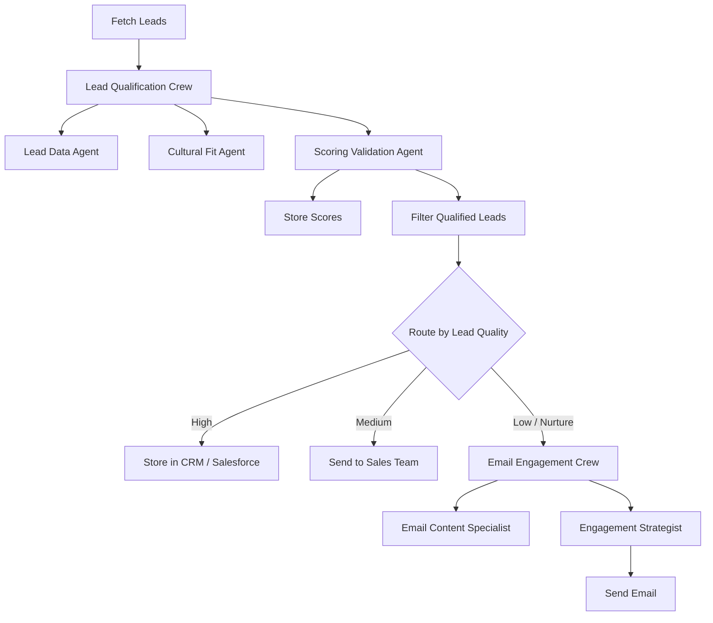

# 🚀 Agentic Sales Pipeline with CrewAI

<div align="center">


**Turn outbound sales research, lead scoring, and personalized outreach into a repeatable AI workflow.**

Built for B2B agencies, SaaS founders, RevOps teams, and consultants who want to qualify leads faster, personalize outreach at scale, and reduce manual prospecting overhead.

</div>

---

## 💼 Why this project matters

Most outbound teams still waste hours on:
- manual lead research
- inconsistent qualification criteria
- generic cold emails
- slow handoffs between SDR, RevOps, and marketing

This project demonstrates how to replace that friction with an **agentic, production-ready sales workflow** powered by **CrewAI agents, structured outputs, and Flow orchestration**.

### Value proposition for B2B / SaaS clients

This system helps teams:
- qualify leads with **consistent AI scoring**
- enrich lead and company context with **web research tools**
- generate **high-personalization outreach**
- route leads through **different actions based on quality**
- track **token usage and estimated cost**

The result: **less manual work, faster pipeline movement, and higher-quality outbound execution.**

---

## ⚡ Manual outbound vs AI-powered outbound

| Stage | Manual sales workflow | Agentic AI workflow |
|---|---|---|
| Lead research | Rep spends 5–15 min per lead | AI agents gather and validate context automatically |
| Qualification | Subjective and inconsistent | Structured scoring with validation logic |
| Personalization | Often rushed or templated | Role-specific messaging with use-case alignment |
| Routing | Done manually in CRM or spreadsheets | Flow-based conditional routing for high / medium / low leads |
| Cost visibility | Hidden in labor time | Token usage and cost estimates tracked per run |
| Scalability | Limited by headcount | Repeatable and parallelizable |

### Before
- SDRs lose time researching the same data repeatedly  
- Messaging quality varies by rep  
- Good-fit leads get buried in noisy lists  
- Sales ops work becomes a bottleneck  

### After
- AI agents standardize research and scoring  
- High-fit leads surface quickly  
- Personalized outreach becomes easier to scale  
- Teams get an automation-ready workflow they can extend into CRM, email, or enrichment systems  

---

## 🧠 What’s inside

### Lead qualification crew
This project includes **3 specialized agents** for lead qualification:

1. **Lead Data Agent**  
   Collects lead, company, role, and use-case context.

2. **Cultural Fit Agent**  
   Evaluates alignment between company profile, strategic context, and likely adoption fit.

3. **Scoring Validation Agent**  
   Produces a validated lead score using structured Pydantic output.

### Email engagement crew
This project includes **2 specialized agents** for outbound messaging:

1. **Email Content Specialist**  
   Drafts personalized outreach based on the lead context.

2. **Engagement Strategist**  
   Refines messaging for clarity, conversion, and call-to-action strength.

### Flow orchestration
The repository includes:
- a **simple pipeline**
- a **complex pipeline with conditional routing**
- token and cost tracking helpers
- production-oriented repo layout, tests, docs, CI, and Docker support

---

## 🏗️ Architecture



### ASCII view

```text
┌──────────────┐
│ Fetch Leads  │
└──────┬───────┘
       ▼
┌──────────────────────────┐
│ Lead Qualification Crew  │
│  • Lead Data Agent       │
│  • Cultural Fit Agent    │
│  • Scoring Validator     │
└──────┬───────────────────┘
       ▼
┌─────────────────────┐
│ Filter / Route Lead │
└───┬──────────┬──────┘
    │          │
    │          └──────────────┐
    ▼                         ▼
High-value                Medium / Low
store in CRM              nurture / handoff
                              │
                              ▼
                  ┌────────────────────────┐
                  │ Email Engagement Crew  │
                  │ • Content Specialist   │
                  │ • Engagement Strategist│
                  └────────────┬───────────┘
                               ▼
                           Send Email
```

See [`docs/architecture.md`](docs/architecture.md) for a more detailed breakdown.

---

## 🎯 Example use cases

| Client type | Use case | Outcome |
|---|---|---|
| SaaS startup | Score inbound demo requests before AE review | Better prioritization and faster follow-up |
| Outbound agency | Research prospects and draft personalized emails | Higher throughput with less manual effort |
| RevOps consultant | Add AI qualification layer before CRM routing | More consistent pipeline hygiene |
| Fractional SDR team | Personalize nurture emails for medium-fit leads | More touches without burning rep time |
| B2B service firm | Build prospect research packs before outreach | Stronger first-touch relevance |

---

## 📈 ROI illustration

> These numbers are illustrative and intended for client conversations or proposal framing.

### Scenario: 500 leads / month

| Metric | Manual process | Agentic process |
|---|---:|---:|
| Avg research + scoring time / lead | 10 min | 2 min effective review time |
| Monthly hours | 83.3 hrs | 16.7 hrs |
| Hours saved | — | **66.6 hrs** |
| At $50/hr SDR cost | — | **$3,330 saved / month** |

### Scenario: 1,500 leads / month

| Metric | Manual process | Agentic process |
|---|---:|---:|
| Avg research + scoring time / lead | 8 min | 1.5 min effective review time |
| Monthly hours | 200 hrs | 37.5 hrs |
| Hours saved | — | **162.5 hrs** |
| At $60/hr blended cost | — | **$9,750 saved / month** |

### Revenue upside framing
If better lead scoring improves reply-to-meeting conversion by even a small margin, the value compounds quickly:
- more qualified conversations
- fewer wasted rep hours
- stronger personalization
- better pipeline coverage without linear hiring

---

## 🛠️ Tech stack

- **CrewAI** for agents, tasks, crews, and flows
- **Pydantic** for structured lead scoring output
- **SerperDevTool** for web search enrichment
- **ScrapeWebsiteTool** for page-level context extraction
- **PyYAML** for configuration-driven agent/task setup
- **Pytest** for basic tests
- **Docker Compose** for local execution

---

## 🚀 Quick start

### 1) Clone the repo
```bash
git clone https://github.com/yourusername/agentic-sales-pipeline-crewai.git
cd agentic-sales-pipeline-crewai
```

### 2) Create environment variables
```bash
cp .env.example .env
```

Add your API keys to `.env`.

### 3) Install dependencies
```bash
pip install -r requirements.txt
```

### 4) Run the demo
```bash
python examples/demo.py
```

### 5) Run tests
```bash
pytest
```

---

## 🔐 Environment variables

Required keys are documented in [`.env.example`](.env.example).

Typical setup:
```env
OPENAI_API_KEY=your_openai_key
OPENAI_MODEL_NAME=gpt-4o-mini
SERPER_API_KEY=your_serper_key
```

---

## 📂 Repository structure

```text
.
├── config/
│   ├── email_engagement_agents.yaml
│   ├── email_engagement_tasks.yaml
│   ├── lead_qualification_agents.yaml
│   └── lead_qualification_tasks.yaml
├── docs/
│   ├── api.md
│   └── architecture.md
├── examples/
│   └── demo.py
├── src/
│   ├── crews.py
│   ├── flow.py
│   └── models.py
├── tests/
│   └── test_pipeline.py
├── docker-compose.yml
├── setup.py
└── UPWORK_PROPOSAL_TEMPLATE.md
```

---

## 💎 Why hire me

If you’re an Upwork client looking for **premium AI automation talent**, this repository demonstrates the kind of work I can build for you:

### I can help you with
- AI sales automation systems
- agentic lead qualification workflows
- outbound personalization engines
- CRM / email / webhook integrations
- proof-of-concept → MVP → production handoff
- internal tooling for RevOps and go-to-market teams

### What you’re actually buying
You are not just hiring someone to “use AI.”  
You are hiring someone who can:
- design automation around business outcomes
- structure agents so outputs are usable
- build maintainable configuration-driven systems
- document the solution professionally
- package work so your team can extend it later

### Strong fit for clients who want
- a premium prototype they can show stakeholders
- a client-ready AI automation demo
- custom lead research and outreach workflows
- a consultant who can communicate clearly and ship polished deliverables

---

## 🧪 Production-readiness highlights

- structured outputs with Pydantic
- modular YAML-based configuration
- simple and advanced Flow examples
- tests for routing and filtering logic
- CI workflow for validation
- Docker Compose support
- clean docs and setup instructions
- proposal template for selling the solution

---

## 📣 Call to action

If you’re a founder, agency owner, or RevOps leader and you want a custom version of this system for your sales process:

**Let’s build a client-specific AI pipeline that saves your team time and creates revenue leverage.**

Use this repo as a portfolio sample, then tailor it for:
- your ICP
- your lead sources
- your CRM
- your email platform
- your qualification rules
- your reporting stack

---

## 📄 License

MIT — see [`LICENSE`](LICENSE).
